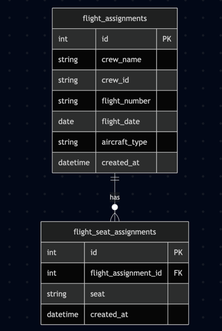

# Seat Voucher App

A fullstack app for generating crew seat vouchers based on flight and aircraft information. A take home project by BookCabin.
Built with:

- **Frontend**: Vite + React + Material UI (MUI)
- **Backend**: Go (Gin + Gorm), SQLite
- **Dev Stack**: Docker Compose (multi-service)

---

## Run with Docker (Recommended)

### 1. Prerequisites

Docker is required. Please install Docker Desktop before proceeding: https://www.docker.com/products/docker-desktop

Build and Run

```bash
docker compose up --build
```

This will:

- Build and run the Go backend on http://localhost:8081  
- Build and serve the React frontend on http://localhost:3000  

---

### 2. Access the App

Open your browser:

http://localhost:3000

Try generating vouchers by entering:
- Name
- ID
- Flight Number (e.g. `JT692`)
- Date (`DD-MM-YY`)
- Aircraft Type (e.g. `Airbus 320`)

---

### 3. Relationship



[Mermaid Js](https://mermaid.live/edit#pako:eNqlUslugzAQ_RU0ZxKBwxJ87XKpKlXqrUJCLp6A1diOjFGbkvx7DWQRIu2lc7DG783zLJ4OSs0RKKC5F6wyTObKc7bZiqq2BWsaUSmJyjbe4bBY6O7MNMimNPVq1vwq7kamN6GsJ7j38nSFGmuEqrzS4GehmMTbjOAz_JRJtfIdzZXlzOKZ6_2ZjglTGraxhd3vcKqzQmKfz7m8YPYG2e74hDxOup4N5u_We2g2L9eq9zifT__0v4sFHyQayQR3vz7UloOt0Q0dqHM5Mx855KqPG7UPXFhtgG7YtkEfWGv1616VF2CMOm3PBcVB9Twu17BjPuyYetPaxVjT4nAF2sEXUJKSZUDCaB3FQRCTJPJhDzQOl-skiKNslaVxEgfk6MP3oA-WaZak4SpzZ5YQsiI-GN1W9SV9Zfr-xjwGFUdzp1tlgSZhevwBg9LxIw)

## Author

Apriyanto Arkiang — Backend engineer with 8+ years of experience.

---
